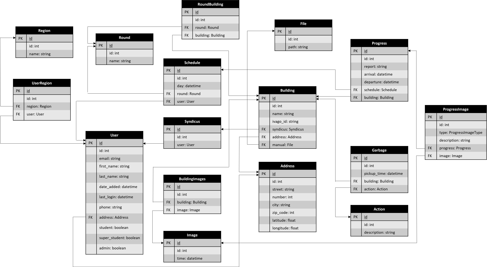

# Database

## ORM

De database wordt beheerd aan de hand van PrismaORM. We definiëren het schema in `./prisma/schema.prisma`. De database wordt geïnitialiseerd met het volgende commando.

```shell
npx prisma db push
```

## Design

De relaties tussen de verschillende entteiten wordt hieronder gegeven. Merk echter op dat deze niet noodzakelijk finaal zijn. Voor meer informatie, zie `./prisma/schema.prisma`



## Deployment

We voorzien een PostgreSQL database in de `server/docker-compose.yml` stack. Zie `server/README.md` voor meer informatie.
