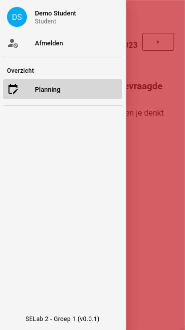

# Navigatiebalk
Een gebruiker kan snel en eenvoudig door de applicatie navigeren door van de navigatiebalk gebruik te maken.
Naargelang het type gebruiker zult u meer of minder opties hebben in de navigatiebalk.

## Openen en sluiten
### Student
De navigatiebalk kan de student openen door op het hamburgermenu (☰) te klikken en sluiten door naast de
open staande navigatiebalk te klikken.

|          Open navigatie          |          Sluit navigatie          |
|:--------------------------------:|:---------------------------------:|
|  |  |

### Superstudent, Syndicus, Admin
De Superstudent, Syndicus en Admin kunnen de navigatie balk openen door op het hamburgermenu (☰) te klikken.
Om de navigatie balk te sluiten, klikt men simpelweg nogmaals op het hamburgermenu (☰).

|        Open / sluit navigatie        |
|:------------------------------------:|
|  |
