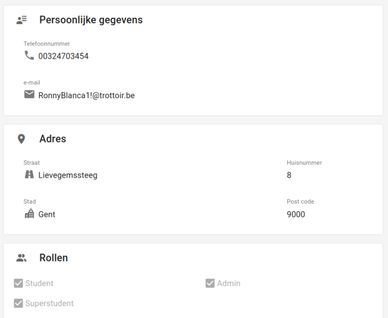

# Accountpagina

|           Account pagina            |                   Account pagina                    |
|:-----------------------------------:|:---------------------------------------------------:|
|  |  |

Een [student](../../users/student.md), [administrators](../../users/admin.md), [superstudenten](../../users/superstudent.md) en [syndici](../../users/syndicus.md) kan zijn persoonlijke informatie op deze pagina terugvinden. (email,telefoonnummer,adres)

## Hoe bereiken

Elke gebruiker kan zijn eigen accountpagina vinden door in de navbar op zijn eigen naam te klikken.
De administrator en superstudent kunnen de verschillende gebruikers vinden door in [gebruikers](../administration/gebruikers.md) op een naam te klikken.

## Workflow

Bij het openen van die pagina wordt alle informatie getoond over de gebruiker. Als men deze wil wijzigen kan men op de knop [Bewerk account](update_account.md)(1) klikken.

## Gebruikers

### Studenten (mobiel)

Voor [studenten](../../users/student.md) zal de pagina meestal op een kleiner scherm gebruikt worden.
Hiervoor voorzien we in plaats van de grote `Bewerk Account` knop een kleinere knop met een potlood in.

## superstudent

Een [superstudent](../../users/superstudent.md) kan ook de statistieken van andere gebruikers bekijken.

### Admin

De [administrator](../../users/admin.md) gaat ook zijn verschillende rollen kunnen zien.
