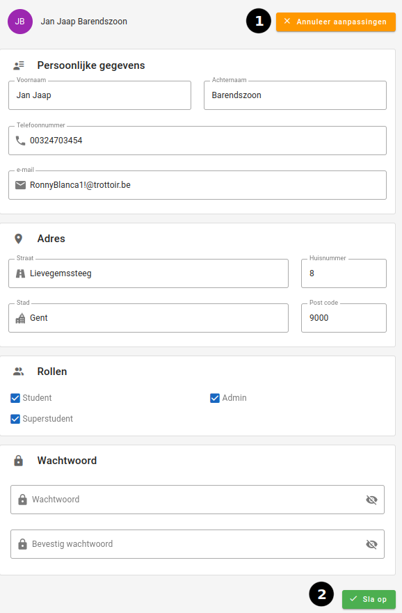

# Account bewerken

|       Account bewerken pagina        |
|:------------------------------------:|
|  |

Een [student](../../users/student.md), [administrators](../../users/admin.md),[superstudenten](../../users/superstudent.md) en [syndici](../../users/syndicus.md) kan zijn persoonlijke informatie op deze pagina veranderen. (email,telefoonnummer,adres, wachtwoord)

## Hoe bereiken

De account-bewerkingspagina kan gevonden worden door in de [accountpagina](account.md) op `Bewerk Account` te klikken.

## Workflow

Bij het openen ziet de gebruiker de huidige persoonlijke informatie.
Deze velden kunnen gewijzigd worden door in het veld de waarde aan te passen.

1. Als men de veranderde waarden toch niet wil opslaan, kan men op `Annuleer aanpassingen` klikken.

2. Als u de wijzigingen wilt opslaan, kan u op de knop `Sla op` klikken.

## Gebruikers

### Studenten (mobiel)

Voor [studenten](../../users/student.md) zal de pagina meestal op een kleiner scherm gebruikt worden.
Hiervoor voorzien we in plaats van de grote `Annuleer aanpassingen` knop een kleinere knop met een kruis in.

### Administrators

De [administrator](../../users/admin.md) gaat ook zijn rollen kunnen veranderen.
