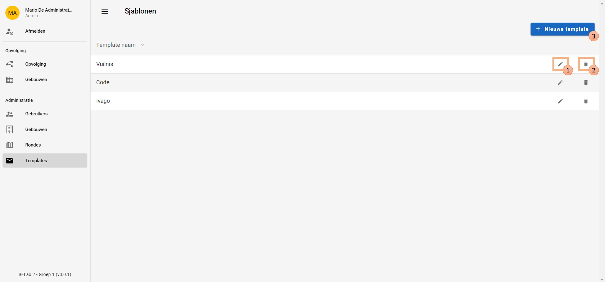
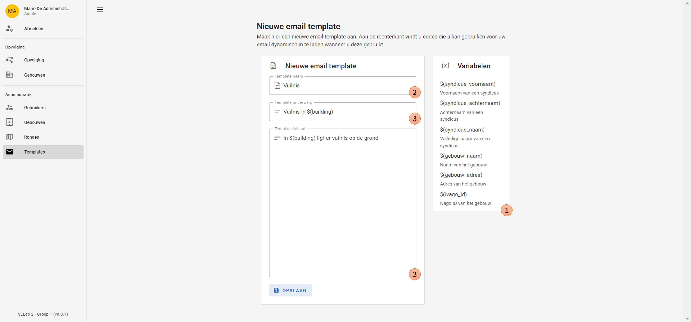

# E-mail sjablonen
Bij het sturen van een mail naar een syndicus (op een [andere pagina](../contact/contact_syndicus.md)) kunnen vooraf geschreven
sjablonen van e-mails gebruikt worden. Op die manier moeten superstudenten en admins niet elke keer een gelijkaardige
mail opstellen. Het enige dat ze bij de sjablonen nog moeten doen, is het aanpassen van specifieke
variabelen, zoals namen, adressen ...

De sjablonen kunnen enkel door superstudenten en administratoren aangemaakt worden.

## Workflow
Bij het openen van de pagina worden alle bestaande e-mail sjablonen opgelijst.
Hierbij kan je een sjabloon aanpassen (optie 1), deze verwijderen (optie 2)
of een nieuwe aanmaken (optie 3).
De naam van het sjabloon geeft meer informatie over de inhoud van de mail.

|            Overzicht van e-mail sjablonen            |
|:----------------------------------------------------:|
|  |

Als een gebruiker een sjabloon wil bewerken of toevoegen, wordt hij doorverwezen naar een andere pagina, hieronder afgebeeld.
1. Bij het opstellen van een sjabloon kunnen verschillende variabelen gebruikt worden.
Voordat de e-mail dan gestuurd wordt (via een [ander pagina](../contact/contact_syndicus.md)),
moet de superstudent/admin deze variabelen nog vervangen door de bijhorende waarden.
2. In dit veld wordt de naam van het sjabloon bijgehouden zodat de inhoud ervan meteen duidelijk is.
Hierin worden geen variabelen gebruikt, dit is louter ter informatie voor de superstudent/admin.
3. Hier wordt het onderwerp van de e-mail geplaatst en deze mag wel variabelen bevatten.
4. Ook de inhoud van de mail mag variabelen bevatten.

Bij het aanpassen van een sjabloon worden al deze velden
reeds ingevuld en kan de superstudent/admin kleine wijzigingen aanbrengen.

|             E-mail sjabloon bewerken/aanmaken             |
|:---------------------------------------------------------:|
|  |
