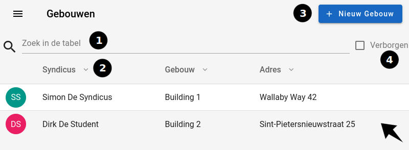

# Gebouwen

Op deze pagina kan u een oplijsting terugvinden van alle gebouwen.

|           Gebouwen pagina            |
| :----------------------------------: |
|  |

## 1. Zoekbalk

Je kunt een bepaalde naam zoeken met behulp van de zoekbalk die zich boven de tabel bevindt.(1)

## 2. Sorteren per type

Bovenaan de tabel is er een hoofding die de tabel in 3 kolommen opsplitst.
Door op het pijltje naast de titel van elke kolom te klikken, zal u de tabel
sorteren volgens die kolom (2).

-   Syndicus: De naam van de gebruiker die syndicus is van het gebouw.
-   Gebouw: De naam van het gebouw.
-   Adres: Het adres van het gebouw.

## 3. Nieuwe gebouw aanmaken

Om een nieuw gebouw aan te maken, klikt u op de `nieuw gebouw`(3) knop. Dit zal u doorsturen
naar de pagina om een [nieuw gebouw](../create/create_gebouwen.md) aan te maken.

## 4. Verborgen gebouwen

Aan de rechterkant bevindt zich een selectievak(4) waarmee je ook de verwijderde gebouwen kunt bekijken. Echter, dit selectievak is alleen zichtbaar als je als admin ingelogd bent.

## 5. Klikken op een rij

Wanneer u op een rij klikt, zal u doorgestuurd worden naar de [gebouwpagina](../detail/gebouw.md)
van de gebruiker.
