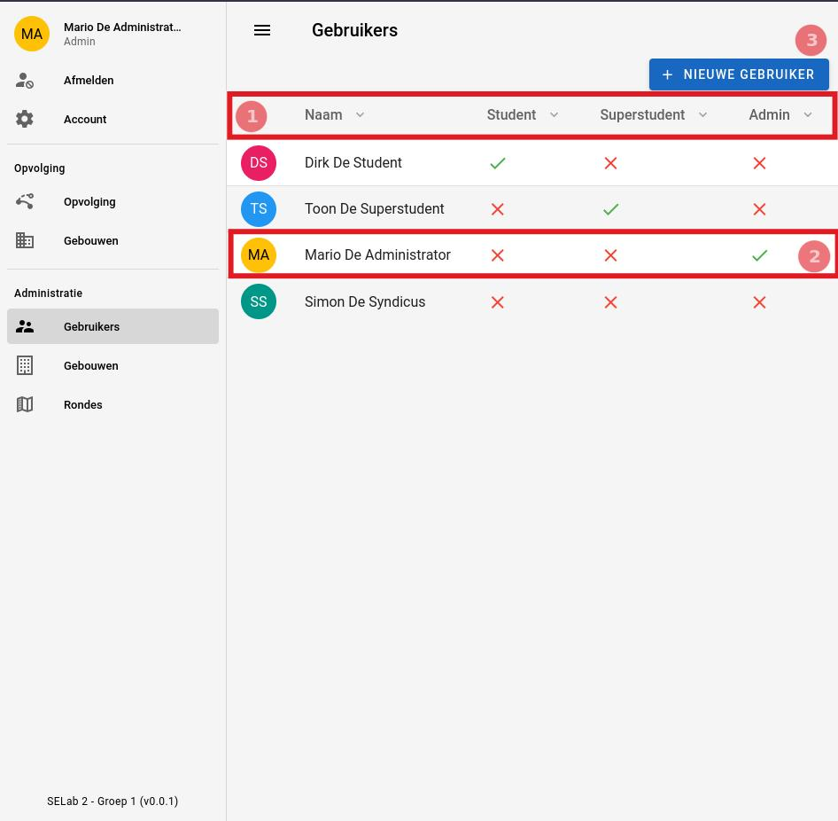

# Gebruikers

|                Gebruikers pagina                |
|:-----------------------------------------------:|
|  |

## 1. Sorteren per type
Bovenaan de tabel is er een hoofding die de tabel in 4 kolommen splitst.
Door op het pijltje naast de titel van elke kolom te klikken zal je de tabel
sorteren volgens die kolom.

- Naam: De naam van de gebruiker.
- Student: Geeft aan of de gebruiker al dan niet een student is.
- Superstudent: Geeft aan of de gebruiker al dan niet een superstudent is.
- Admin: Geeft aan of de gebruiker al dan niet een administrator is.

## 2. Klikken op een rij
Als u op een rij klikt zal u doorgestuurd worden naar de [account](../account.md) pagina
van de gebruiker.

## 3. Nieuwe gebruiker aanmaken
Om een nieuwe gebruiker aan te maken klikt u op de `nieuwe gebruiker` knop. Dit zal u doorsturen
naar de pagina om een [nieuwe gebruiker](./create_gebruikers.md) aan te maken.
