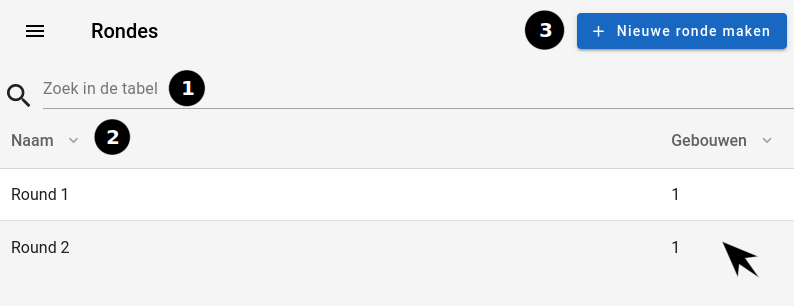

# Rondes

Op deze pagina kan u een oplijsting terugvinden van alle rondes.

|            Ronde pagina            |
| :--------------------------------: |
|  |

## 1. Zoekbalk

Je kunt een bepaalde naam zoeken met behulp van de zoekbalk die zich boven de tabel bevindt.(1)

## 2. Sorteren per type

Bovenaan de tabel is er een hoofding die de tabel in 2 kolommen opsplitst.
Door op het pijltje naast de titel van elke kolom te klikken, zal u de tabel
sorteren volgens die kolom.(2)

-   Naam: De naam van de ronde.
-   Gebouwen: Het aantal gebouwen in een ronde.

## 3. Klikken op een rij

Wanneer u op een rij klikt, zal u doorgestuurd worden naar de [rondepagina](../detail/ronde.md)
van de gebruiker.

## 4. Nieuwe ronde aanmaken

Om een nieuwe ronde aan te maken, klikt u op de `nieuwe ronde maken` (3) knop. Dit zal u doorsturen
naar de pagina om een [nieuwe ronde maken](../create/create_gebouwen.md) aan te maken.
