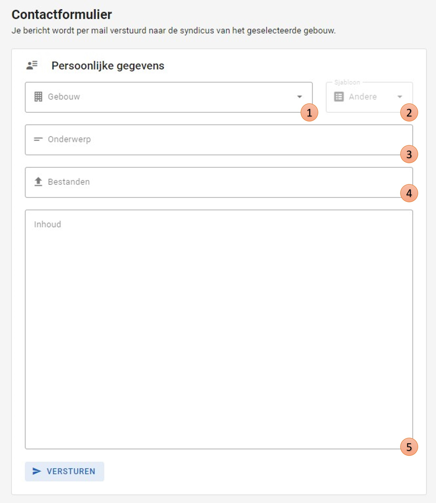

# Contact
Het is mogelijk dat een syndicus gecontacteerd moet worden over zijn gebouw.
In dit geval kan een mail opgesteld en gestuurd worden via de site zelf.

Enkel superstudenten en administrators hebben toegang tot deze pagina.
Studenten kunnen dus zelf geen mails versturen,
maar kunnen enkel de opmerkingen toevoegen tijdens het uitvoeren van hun ronde.

## Werking
1. Door een specifiek gebouw aan te duiden (via optie één op de foto) wordt de mail automatisch naar de juiste syndicus gestuurd.
Het e-mailadres van de syndicus moet dus niet meer apart opgezocht worden.
2. Hierbij kan een thema gekozen worden die een sjabloon e-mail invult in de velden van het onderwerp (3) en de inhoud (5).
3. Het onderwerp wordt automatisch ingevuld bij het selecteren van een sjabloon, maar kan handmatig aangepast worden.
4. Er kunnen meerdere bestanden als bijlage toegevoegd worden.
5. Ook de inhoud wordt automatisch opgesteld bij het gebruiken van een sjabloon.
Hierbij moeten echter nog enkele variabelen zelf ingevuld worden zoals de naam van het gebouw, de syndicus ...

Uiteindelijk kan de mail verzonden worden zonder dat de superstudent of administrator
zelf zijn eigen programma hiervoor moet gebruiken.

| Mail sturen naar syndicus  |
|:--------------------------:|
|  |
