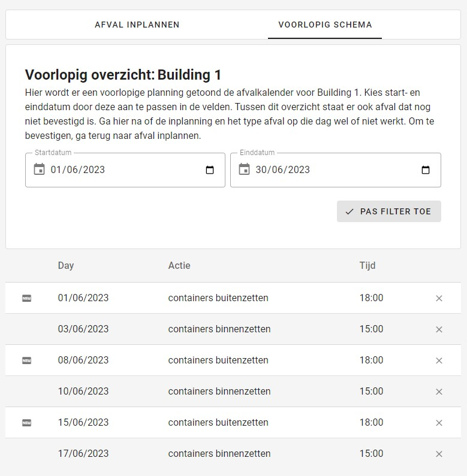

### Afval toevoegen

Een [superstudent](../../users/superstudent.md) of een [admin](../../users/admin.md) kan op deze pagina afval toevoegen aan een gebouw.

|                Nieuw schema                |
|:------------------------------------------:|
|    |

### 1. Beschrijving van de actie
Geef op welke taak er precies moet gebeuren: afval buitenzetten, containers binnen zetten...

### 2. Frequentie
Taken kunnen eenmalig, wekelijks, tweewekelijks of maandelijks gebeuren.

### 3 en 4. Start- en einddatum
Geef een start- en einddatum op.
De startdatum bepaalt op welke dag van de week de taak moet uitgevoerd worden.
Wanneer bijvoorbeeld de frequentie ``wekelijks`` is aangeduid, met als start- en einddatum
respectievelijk 1 en 20 juni 2023, zal de taak gepland worden op donderdag 1, 8, en 15 juni 2023.

### 5. Starttijd
Geef op om welk uur de taak uitgevoerd moet worden.

### 6. Tijdelijk toevoegen
Wanneer u op de knop ``tijdelijk toevoegen`` drukt, wordt de taak toegevoegd aan het voorlopig schema.
U kan op dit moment dus nog taken toevoegen of verwijderen.

### 7. Alles verwijderen
De knop ``alles verwijderen`` verwijdert de volledige voorlopige planning.
U kan ook elk element afzonderlijk verwijderen door op het kruisje te drukken
van de taak die u wenst te verwijderen.

### 8. Voorlopig schema
Hier ziet u een duidelijker overzicht van de taken die aan het voorlopig schema zijn toegevoegd,
samen met de reeds ingeplande taken voor dit gebouw. U kunt deze filteren op datum.
De taken met de tag ``new`` zijn degene die u net aan het voorlopig schema heeft toegevoegd.

|                      Nieuw schema                       |
|:-------------------------------------------------------:|
|  |

### 9. Inplannen
Wanneer u op de knop ``inplannen`` drukt, plant u het voorlopig schema in.
