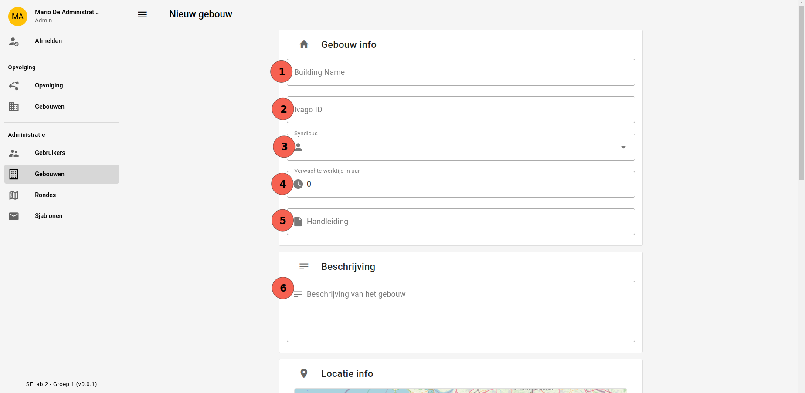
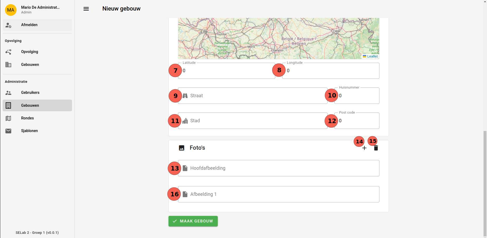

# Nieuw gebouw
Een [admin](../../users/admin.md) kan op deze pagina een nieuw gebouw aanmaken.

|                  Nieuwe gebruiker                  |
|:--------------------------------------------------:|
|  |
|  |

## Annotaties op de afbeelding:
Voor een gebouw te kunnen aanmaken dienen alle velden correct ingevuld te worden. We beschrijven deze velden hieronder:

## 1. Naam van het gebouw
De naam waaronder het gebouw bekend staat.
## 2. Ivago ID
Het nummer gegeven door Ivago aan een gebouw.
## 3. Syndicus
Hier kan de admin kiezen uit elke gebruiker die nog geen rol heeft. Er dient dus eerst een gebruiker aangemaakt te worden op [de aanmaakpagina voor gebruikers](create_gebruikers.md).
## 4. Verwachte werktijd
De tijd die DrTrottoir afspreekt met de klant. Dit wordt opgeslaan in uur.
## 5. Handleiding
Upload hier een pdf of ander bestand waarin gebruikers een gemakkelijk en overzichtelijke weergave krijgen over noodzakelijke informatie in het gebouw.
## 6. Beschrijving
Hier krijgt de klant de kans om wat meer over zijn gebouw te schrijven dan enkel de naam.
## 7 & 8. Lat- en longitude
De coordinaten van het gebouw in lat- en longitude. Door deze in te geven kunnen we overzichtelijker een ronde plannen.
## 9 - 12. Adresgegevens van het gebouw
Hier worden de adresgegevens voor een gebouw ingegeven.
## 13. Hoofdafbeelding
Upload hier een afbeelding die op veel paginas zal gebruikt worden om u gebouw voor te stellen. Zorg ervoor dat het gebouw goed zichtbaar is.
## 14 & 15. Extra afbeeldingen toevoegen/verwijderen
Door op deze knoppen te drukken kunnen er extra afbeeldingen verwijderd of toegevoegd worden aan dit gebouw. De hoofdafbeelding zal echter wel niet verwijderd kunnen worden.
## 16. Extra afbeelding
Hier is er een extra inputveld te zien waarin er een extra afbeelding geuploaded kan worden.

