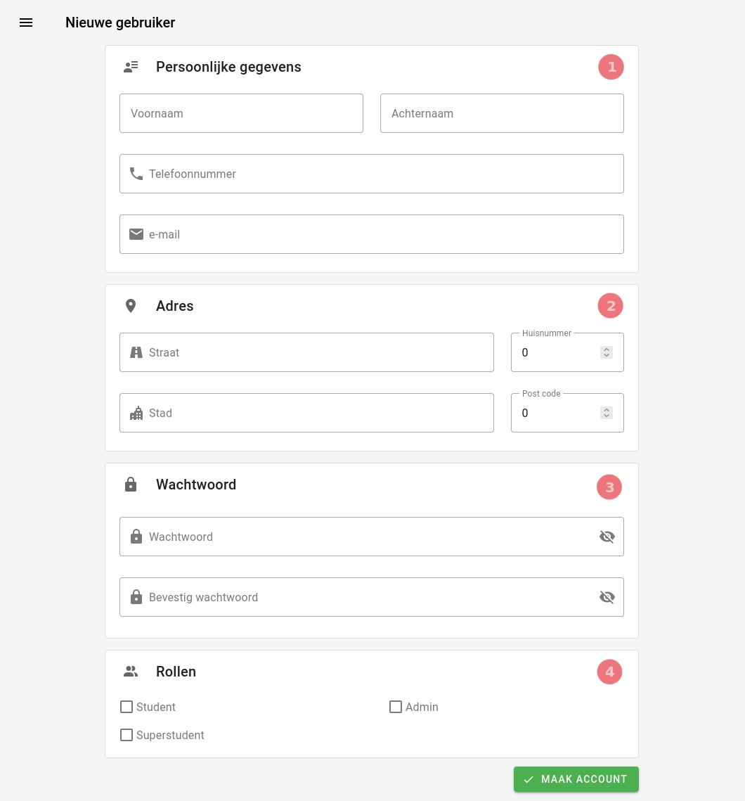

# Nieuwe gebruiker
Een [admin](../../users/admin.md) kan op deze pagina een nieuwe gebruiker aanmaken.

|                  Nieuwe gebruiker                  |
|:--------------------------------------------------:|
|  |

Hiervoor moeten alle velden correct ingevuld worden.
Bij het foutief invullen van een veld zal er een waarschuwing verschijnen
die aangeeft wat er mis liep.

### 1. Persoonlijke gegevens
Alle velden moeten verplicht ingevuld worden.
### 2. Adres
Alle velden moeten verplicht ingevuld worden.
### 3. Wachtwoord
- Dit is het wachtwoord dat de gebruiker voor zijn of haar account
zal gebruiken. De gebruiker zal later zelf het wachtwoord kunnen aanpassen.
- Klik op het oog icoontje (👁) om het wachtwoord te tonen. Klik er nogmaals op om het
opnieuw te verbergen.

### 4. Rollen
Hier heeft u de optie om de gebruiker een rol te geven.
Merk op dat de gebruiker gebruik zal kunnen maken van alle privéleges horende bij de rol.
**Geef een gebruiker steeds de minimale machtigingen** nodig om zijn of haar taken te vervullen.

U kan een gebruiker een rol geven door het selectievakje bij de rol aan te klikken.
Het is mogelijk om een gebruiker meerdere rollen te geven.

Een [syndicus](../../users/syndicus.md) maakt men aan zonder rollen (tenzij de syndicus ook student,
superstudent of admin is). Bij het
[aanmaken van een gebouw](create_gebouwen.md) kiest men dan simpelweg deze gebruiker.
De gebruiker zal dan automatisch syndicus zijn van dat gebouw.

