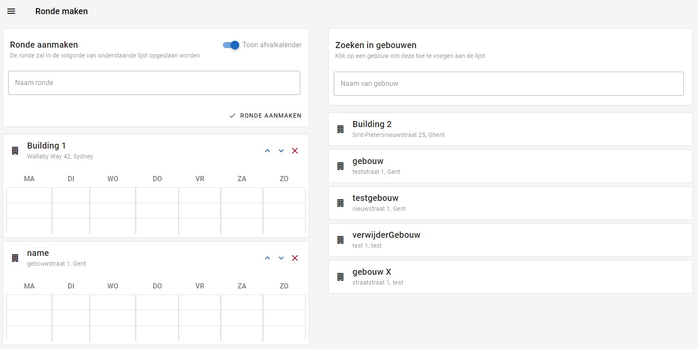
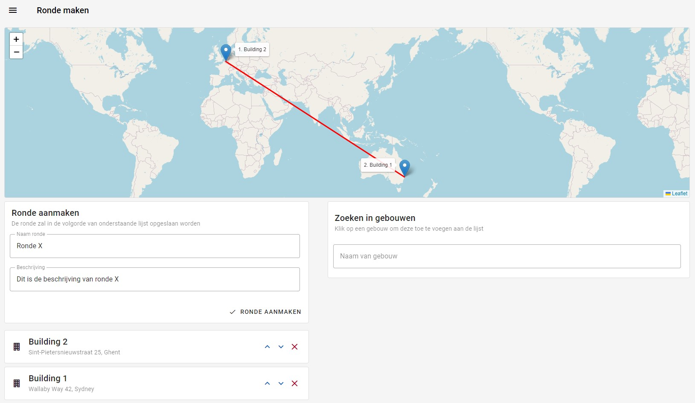

# Nieuwe ronde
Een [admin](../../users/admin.md) of [superstudent](../../users/superstudent.md) kan op deze pagina een nieuwe ronde aanmaken.

|                     Nieuwe ronde                      |
|:-----------------------------------------------------:|
|  |

### 1. Naam
Een ronde moet een naam krijgen.

### 2. Beschrijving
Voeg een beschrijving van de ronde toe.

### 3,4,5. Gebouwen
Een ronde moet natuurlijk ook gebouwen bezitten.
Deze kunnen toegevoegd worden door op het kaartje van het gebouw te klikken (3).
Via de zoekbalk kan het gewenste gebouw makkelijker gevonden worden (4).
Nadat een gebouw toegevoegd is zal deze verschijnen aan de linkerkant van het scherm
alsook op de kaart (5).

|                    Voorbeeld ronde                    |
|:-----------------------------------------------------:|
|  |

De rondes hoeven niet in volgorde toegevoegd te worden.
De volgorde kan gewijzigd worden door op de blauwe pijlen te drukken.
In de finale volgorde is het gebouw dat boven de andere staat ook het eerste gebouw in de ronde.
Via de indices die bij de gebouwen op de kaart staan, wordt dit ook duidelijker.
Wanneer een verkeerd gebouw werd toegevoegd, kan deze verwijderd worden door op het rode kruisje te drukken.

### 6. Aanmaken
De ronde wordt aangemaakt wanneer op de knop ```ronde aanmaken``` wordt gedrukt.
Hierna wordt u doorgestuurd naar de [rondepagina](../detail/ronde.md) van de net aangemaakte ronde.
