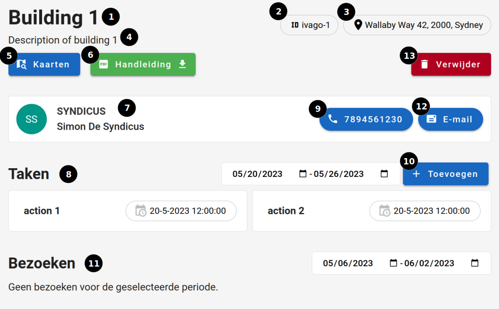

# Gebouw detail pagina

## Hoe bereiken

De gebouw detailpagina kan gevonden worden door als [student](../../users/student.md) in [ronde detail](../ronde/rondedetail.md)op een gebouw te klikken. [Superstudenten](../users/superstudent.md) (& [administrators](../../users/admin.md)) kunnen de pagina bereiken via de [gebouw opvolg](../../pages/followup/gebouw_opvolging.md) pagina, de [gebouwen](../administration/gebouwen.md) pagina en in de [ronde detail](../../pages/detail/ronde.md)pagina. [Syndicus](../../users/syndicus.md) kan deze pagina vinden door in de [navbar](../../navbar.md) bij `Mijn gebouwen` een gebouw te selecteren.

## Overzicht

De pagina is zowel beschikbaar op een computer- als een mobiel scherm.

### Algemeen

Volgende elementen ziet elke gebruiker:

1. Geeft de naam van het gebouw weer.
2. Geeft de ivago-id van het gebouw weer.
3. Geeft het adres van het gebouw weer.
4. Geeft een beschrijving van het gebouw weer.
5. Deze knop verwijst u door naar een google maps kaar met de locatie van het gebouw.
6. Met deze knop kunt u de handleiding downloaden van het gebouw.
7. Geeft de naam van de syndicus weer.
8. Geeft alle acties van het gebouw tussen 2 datums weer.

### Student

Volgende elementen ziet een [student](../../users/student.md) extra:

9. Deze knop geeft het telefoon nummer van de syndicus weer. Als u op deze knop klikt zal u bellen naar de syndicus.

### Super-student

Volgende elementen ziet een [superstudent](../../users/superstudent.md) extra:

10. Met deze knop kunt u extra [taken toevoegen](../create/create_afval.md).
11. Geeft alle bezoeken tussen 2 datums weer.
12. Deze knop verwijst u naar een [contactformulier](../../pages/contact/contact_syndicus.md).

### Administrators

Volgende elementen ziet een [administrator](../../users/admin.md) extra:

13. Met deze knop kunt u een gebouw verwijderen.

|            Detail Gebouw            |
| :---------------------------------: |
|  |
