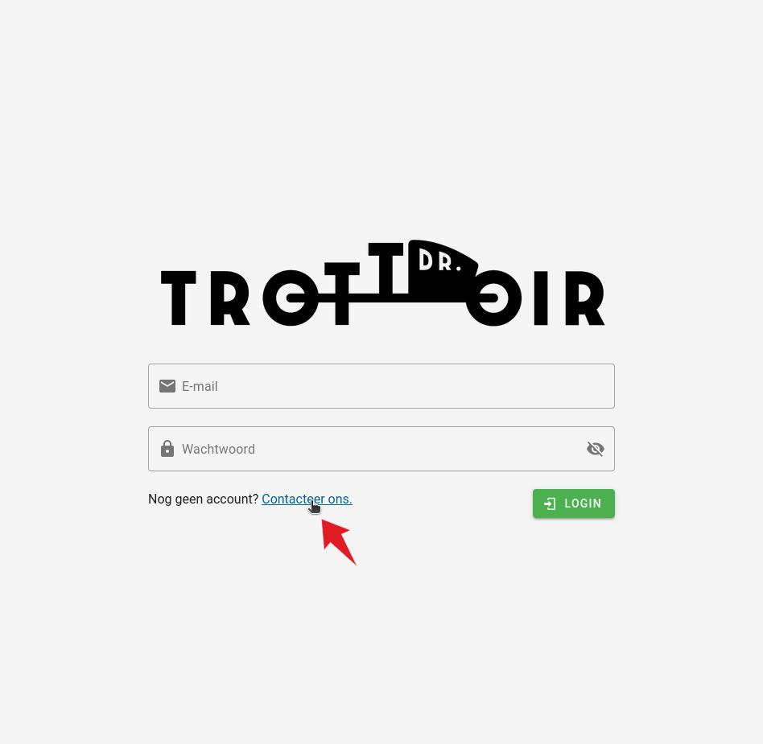
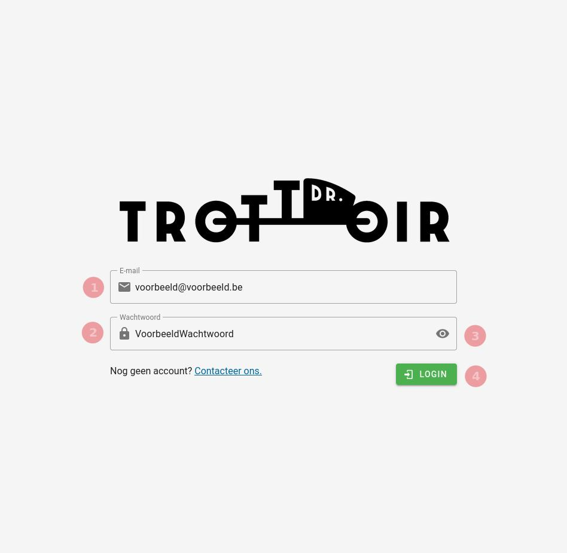

# Login
Voordat u de applicatie kan gebruiken moet u eerst ingelogd zijn.

## Nog geen account

Indien u nog niet over een account beschikt kan u er een aanvragen.
Na het klikken op de `Contacteer ons` link zal er een popup verschijnen met contact de gegevens van
een Dr Trottoir. Hiernaar kan u uw account aanvraag door sturen.

|       Account aanvragen       |
|:-----------------------------:|
|  |

## Inloggen
Als u beschikt over uw account gegevens kan u inloggen met de volgende 4 stappen:
1. Geef uw e-mail adres op in het daarvoor voorziene invoer veld.
2. Geef uw wachtwoord op in het daarvoor voorziene wachtwoord veld.
3. Indien u uw wachtwoord wilt lezen kan u op het oog icoon (👁) klikken. Klik nogmaals
op het oog icoon om uw wachtwoord opnieuw te verbergen.
4. Eenmaal u uw login gegevens correct heeft ingevoerd kan u inloggen door op de `Login`
knop te duwen.

|            Inloggen            |
|:------------------------------:|
|  |
