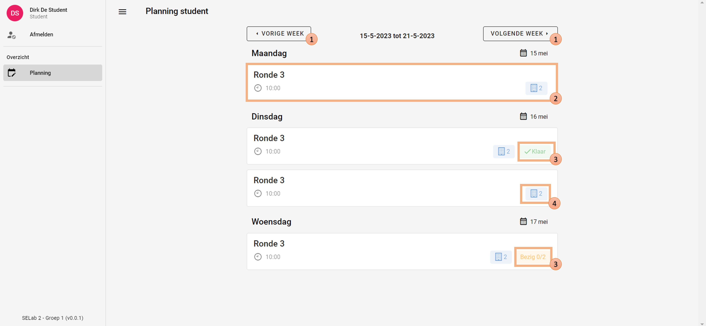

# Planning

De planningspagina toont welke rondes een student moet uitvoeren in een specifieke week.

## Autorisatie
Enkel de student heeft autorisatie om deze pagina te zien.
Hierbij wordt ook enkel de planning getoond die toegekend is aan de ingelogde student,
aangezien planningen van andere studenten voor hem niet van toepassing zijn.

De superstudent en admin kunnen deze pagina niet zien.
Zij kunnen studenten opvolgen via de [ronde-opvolgingspagina](../followup/ronde_overzicht.md).

## Workflow
Bij het openen van de pagina worden alle rondes getoond die de student de huidige week moet uitvoeren.
Hierbij wordt belangrijke informatie ook getoond zodat de student hiervoor niet telkens een andere pagina moet bezoeken.

1. Via de knoppen bovenaan kan de student zijn planning bekijken van vorige en volgende weken.
2. Als een student op deze balk klikt, wordt hij doorverwezen naar de [voortgangspagina](../detail/ronde_scheule.md) van de ronde,
   waar hij dan de ronde kan starten.
3. Als een student bezig is met een ronde of deze al voltooid heeft, worden extra iconen getoond op de pagina.
   Indien de ronde nog niet klaar is, kan de student zien hoeveel gebouwen hij wel al afgerond heeft.
   Als er niks extra bij de ronde staat, is de student dus nog niet begonnen.
4. Als laatste wordt ook nog vermeld uit hoeveel gebouwen de ronde bestaat.

|        Planningspagina         |
|:------------------------------:|
|  |
