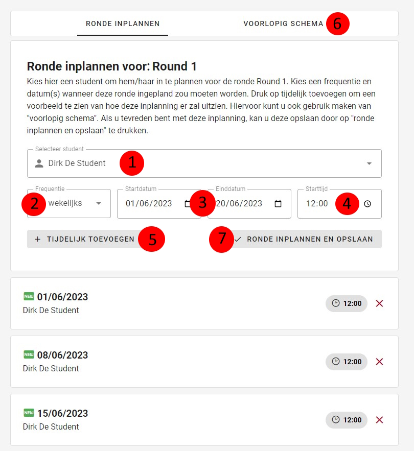
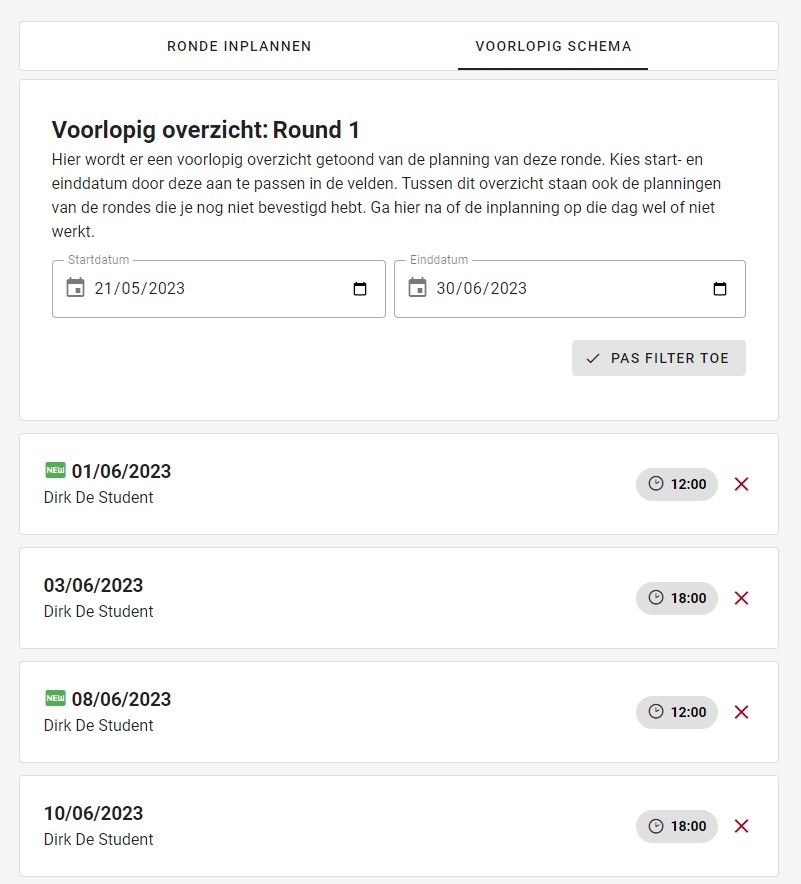

### Ronde inplannen
Een [superstudent](../../users/superstudent.md) of [admin](../../users/admin.md) kan op deze pagina een ronde inplannen.

|            Ronde inplannen             |
|:--------------------------------------:|
|  |

### 1. Student
Selecteer de student die de ronde moet uitvoeren

### 2. Frequentie
Selecteer de frequentie waarmee de student deze ronde zal uitvoeren.
Het kan zijn dat de student deze ronde eenmalig, wekelijks, tweewekelijks of maandelijks moet uitvoeren.

### 3. Start- en einddatum
Geef de datum op waarop de student deze ronde voor het eerst moet doen.
Geef ook de datum op waarop de student mag stoppen met deze ronde te doen.
De startdatum bepaalt op welke dag van de week de ronde moet uitgevoerd worden.
Wanneer bijvoorbeeld de frequentie ``wekelijks`` is aangeduid, met als start- en einddatum
respectievelijk 1 en 20 juni 2023, zal de student gepland worden om deze ronde op donderdag 1, 8, en 15 juni 2023 uit te voeren.

### 4. Starttijd
Geef het tijdstip waarop de student met de ronde moet beginnen.

### 5. Tijdelijk toevoegen
Wanneer u op de knop ``tijdelijk toevoegen`` drukt, wordt de ronde toegevoegd aan het voorlopig schema.
U kan op dit moment dus nog rondes toevoegen of verwijderen.

### 6. Voorlopig schema
Hier ziet u een duidelijker overzicht van de taken die u net aan het voorlopig schema heeft toegevoegd,
samen met de reeds ingeplande taken van deze ronde,
waarbij u kunt filteren op datum.
De taken met de tag ``new`` zijn degene die u zojuist aan het voorlopig schema heeft toegevoegd.

|            Voorlopig schema            |
|:--------------------------------------:|
|  |

### 7. Inplannen
Wanneer u op de knop ``inplannen`` drukt, plant u het voorlopig schema in.
