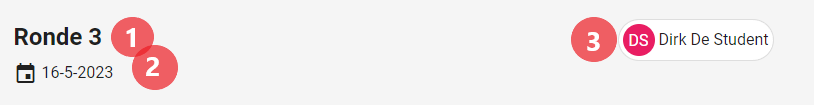
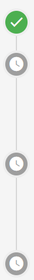
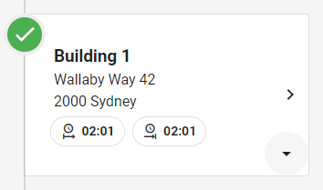
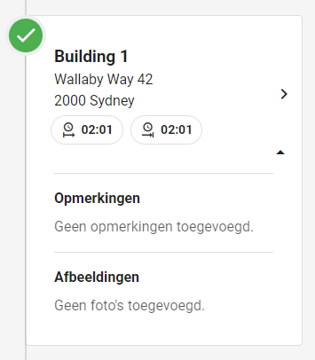
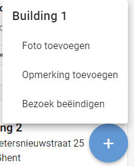
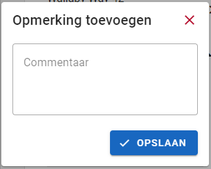
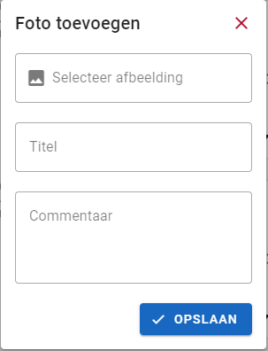
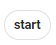
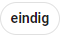
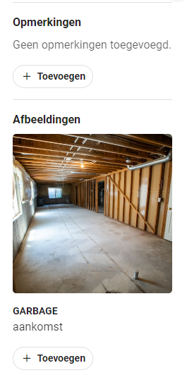

# Ronde detailpagina (planning).
Een [student](../../users/student.md) kan een overzicht van een ingeplande ronde bekijken op een detailpagina. Hier kan de student de gebouwen starten, stoppen en er foto's en commentaar aan toevoegen.
Voor [administrators](../../users/admin.md) en [superstudenten](../../users/superstudent.md) kan deze pagina gebruikt worden om de progressie van de student live op te volgen.
De pagina is niet toegankelijk voor [syndici](../../users/syndicus.md).

## Hoe bereiken
De ronde-detailpagina kan gevonden worden door als [student](../../users/student.md) een ronde te selecteren in zijn [planning](../overview/planning.md).
[Superstudenten](../../users/superstudent.md) (en [administrators](../../users/admin.md)) kunnen de pagina bereiken via de opvolgpagina's:
[rondeopvolging](../followup/ronde_opvolging.md) en [gebouwopvolging](../followup/gebouw_opvolging.md).

## Overzicht
De pagina is zowel beschikbaar op een computer- als een mobiel scherm.

### Algemeen
De pagina bevat voor beide formaten enkele algemene kenmerken. Deze geven overzichtelijk de huidige status van de pagina weer.
Dit is belangrijk aangezien de pagina veel aangepast zal worden.

#### Hoofding
De pagina bevat een kleine header die kort en bondig de info van de ingeplande ronde weergeeft.

|           Rondedetail hoofding           |
|:----------------------------------------:|
|  |

1) Geeft de naam van de ronde weer.
2) Geeft weer voor welke datum de ronde werd ingepland.
3) Geeft de student weer voor wie de ronde werd ingepland.

Op mobiele schermen is deze hoofding iets te breed waardoor de studentennaam wordt weggelaten en vervangen wordt door enkel het icoontje.

#### Timeline
De timeline bevat informatie over de vooruitgang van gebouwen. Hierdoor valt snel te illustreren wanneer een ronde klaar, nog niet begonnen of bezig is.

|                  Onvoltooide timeline                 |                  Voltooide timeline                 |
|:-----------------------------------------------------:|:---------------------------------------------------:|
|  |  |

#### Gebouweninfo
Elk onderdeel van de timeline bevat een kaartje met gebouweninfo. Hierin kunnen [studenten](../../users/student.md), [administrators](../../users/admin.md) en
[superstudenten](../../users/superstudent.md) snel een overzicht krijgen van de progressie van een gebouw.
Een gebouw-info kaartje heeft 2 toestanden: uitgeklapt en ingeklapt.

|             Ingeklapte gebouweninfo            |             Uitgeklapte gebouweninfo            |
|:----------------------------------------------:|:-----------------------------------------------:|
|  |  |

In de hoofding (ingeklapt gedeelte) van het kaartje bevindt zich enkel algemene info: de naam van het gebouw (titel),
het adres van het gebouw (subtitel) en het start- en het einduur voor de opvolging van dit specifieke gebouw (info-chips).
Verder bevindt er zich in de rechteronderhoek een menu-icoontje dat gebruikt kan worden om te wisselen tussen de ingeklapte en uitgeklapte toestand.
Het klikken op de hoofding van het kaartje stuurt de gebruiker door naar de [gebouwenpagina](../detail/gebouw.md).

In de rest van het kaartje bevinden zich de opmerkingen en afbeeldingen voor de planning van het gebouw. Een [student](../../users/student.md) heeft de mogelijkheid deze toe te voegen en aan te passen wanneer de ronde vandaag of in het verleden plaatsvindt. Dit gebeurt door middel van enkele voor de hand liggende knoppen in het kaartje of in de toevoegknop zoals hieronder zal worden beschreven.

### Studenten (mobiel)
Voor [studenten](../../users/student.md) zal de pagina meestal op een kleiner scherm gebruikt worden.
Hiervoor zijn er enkele quality of life features voorzien die het voor de [student](../../users/student.md) makkelijker maken.
[Studenten](../../users/student.md) krijgen de optie om hun eigen rondes (in het verleden) aan te passen.
Dit houdt het starten en stoppen van een gebouw in, alsook het toevoegen van foto's en opmerkingen aan een gebouw.

#### Toevoegknop
Op mobiele schermen bevindt er zich rechts onderaan een blauwe toevoegknop.
Deze kan gebruikt worden om makkelijker en sneller de flow van de rondes te besturen.
Met deze knop kan het volgende gedaan worden:

- Een niet-gestart gebouw starten.
- Een foto toevoegen aan een huidig gebouw.
- Je opmerkingen over het huidige gebouw wijzigen.
- Het huidig gebouw beëindigen.

|            Toevoegknop                      |
|:-------------------------------------------:|
|  |

Voor het toevoegen van foto's en opmerkingen wordt er een pop-up geopend met de relevante informatie.

|           Opmerkingen aanpassen           |            Foto's toevoegen            |
|:-----------------------------------------:|:--------------------------------------:|
|  |  |

#### Gebouw starten en stoppen
Een gebouw kan ook gestart en gestopt worden in de kaartjes zelf. Zo kan de student er ook voor kiezen om de gebouwen in een andere volgorde te doorlopen.
Dit gebeurt door middel van 2 knoppen die zich in de header van het kaartje bevinden.
Wanneer rondes al gestart of geëindigd zijn, wordt deze knop vervangen door het start- of einduur.

|              Ronde starten              |              Ronde eindigen              |
|:---------------------------------------:|:----------------------------------------:|
|  |  |

#### Foto's en opmerkingen toevoegen
Foto's en opmerkingen kunnen ook toegevoegd worden in het kaartje zelf. Dit gebeurt via de voor de hand liggende knoppen in de relevante sectie.
Het aanpassen van opmerkingen kan je gewoon in het tekstveld doen, maar de toevoegknop voor een foto opent dezelfde popup als de toevoegknop.

|            Opmerkingen en afbeeldingen            |
|:-------------------------------------------------:|
|  |

### Superstudenten (computer)
[Superstudenten](../../users/superstudent.md) (en [administrators](../../users/admin.md)) gebruiken de pagina vrijwel altijd op grotere schermen.
Hier bieden we dan de mogelijkheid om ook overzichtelijk de gebouwen en hun opmerkingen te bekijken.
Aangezien [superstudenten](../../users/superstudent.md) enkel de rechten hebben om de rondes op te volgen, mogen deze de ronde niet aanpassen.
Verder krijgen zij dezelfde mogelijkheden en de optie om door te klikken naar het [rondeoverzicht](rondeoverzicht.md).
