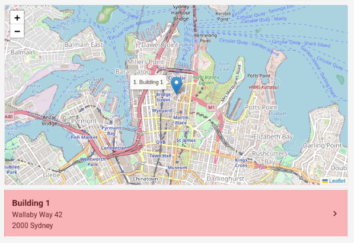
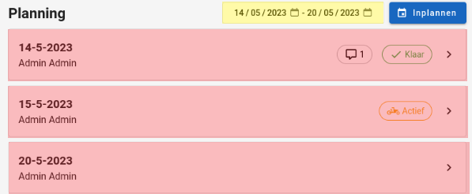
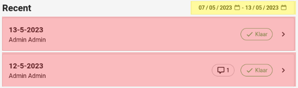

# Ronde
De overzichtspagina van de ronde heeft biedt een overzicht voor alles wat met de ronde te maken heeft.
Deze pagina is bedoelt voor [administrators](../../users/admin.md) & [superstudenten](../../users/superstudent.md) om snel rondes te kunnen beheren en op te volgen.

## Hoe bereiken
De rondedetailpagina kan bereikt worden door als [administrator](../../users/admin.md) og [superstudent](../../users/superstudent.md) op een ronde te klikken.
Dit kan in de [rondetabel](../administration/rondes.md) of in de [detailpagina van een ronde](rondedetail.md).
[Studenten](../../users/student.md). en [syndici](../../users/syndicus.md) hebben geen toegang tot deze pagina en kunnen hem dus ook niet bereiken.

## Overzicht
De pagina bestaat uit 3 grote delen:

- Algemene informatie over de ronde.
- Toekomstige planning van deze ronde.
- Recente planningen van de ronde.

### Ronde titel
Elke ronde heeft een titel waaraan het herkent kan worden. Deze titel bevindt zicht helemaal bovenaan de rondepagina om goed weer te geven over welke ronde deze overzichtspagina gaat.

|               Ronde titel                 |
|:-----------------------------------------:|
|  |

Helemaal rechts van de titel bevindt zich ook een rode knop waarmee de ronde kan verwijdert worden. Dit kan handig zijn wanneer een ronde niet meer in gebruik is.

### Gebouwen
Onder de titel bevinden zich de gebouwen die deel uit maken van deze ronde.
Aangezien een oplijsting van deze gebouwen niet zo overzichtelijk is worden deze ondersteund door een hulpvaardige en interactieve kaart die de posities van alle gebouwen weergeeft.

|             Gebouwen van een ronde            |
|:---------------------------------------------:|
|  |

Door op een gebouwenkaartje te klikken (rode gebied op de afbeelding)
wordt de gebruiker doorverwezen naar de
[overzichtspagina van dit gebouw](../detail/gebouw.md).

### Planning
Vervolgens wordt de planning van het huidige gebouw weergegeven. Hier kan men bekijken hoe de planning van dit gebouw voorlopig zal verlopen.
Standaard wordt de planning voor de komende week (7 dagen in de toekomst) getoond. Maar we kunnen de start en einddatum van dit interval aanpassen. (Gele gebied op de afbeelding).
Wanneer we een planning nauwkeuriger willen bekijken kunnen we op een planning klikken (rode gebied op de afbeelding). De gebruiker wordt dan doorverwezen naar de [detailpagina](rondedetail.md).

|             Planning van een ronde           |
|:--------------------------------------------:|
|  |

We kunnen de planning natuurlijk ook uitbreiden. Dit gebeurt via de blauwe knop in de rechterbovenhoek. Door hier op te klikken wordt de gebruiker gestuurd naar de [planningspagina](ronde_inplannen.md). Daar kan de gebruiker nog overzichtelijker de planning voor de rode bewerken.

### Recente planningen
Als laatste worden er ook planningen van 7 dagen in het verleden getoond. Deze werken exact hetzelfde als de planningen hierboven maar zouden normaal gezien al voltooid moeten zijn. Dit is handig voor de [superstudenten](../../users/superstudent.md) om op te kunnen volgen of de planningen van de ronde worden uitgevoerd en of er opmerkingen zijn.

|             Planning van een ronde           |
|:--------------------------------------------:|
|  |
