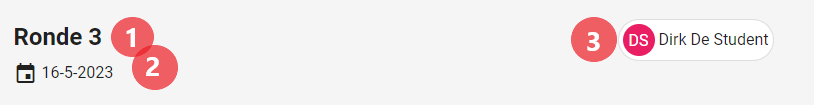
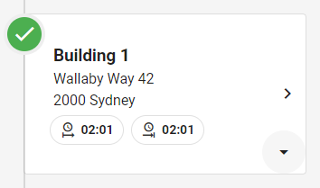

# Ronde detailpagina (planning).
Een [student](../users/student.md) kan een overzicht van een ingeplande ronde bekijken op een detailpagina. Hier kan de student de gebouwen starten, stoppen en er foto's en commentaar aan toevoegen.
Voor [administrators](../users/admin.md) & [superstudenten](../users/superstudent.md) kan deze pagina worden gebruikt om de progressie van de student live op te volgen.
De pagina is niet toehankelijk voor [syndici](../users/syndicus.md).

## Hoe bereiken
De rondedetailpagina kan gevonden worden door als [student](../users/student.md) een ronde te selecteren in zijn [planning](planning.md). [Superstudenten](../users/superstudent.md)  (& [administrators](../users/admin.md)) kunnen de pagina bereiken via doorklikken op de opvolgpagina's: [rondeopvolging](rondeopvolging.md) & [gebouwopvolging](gebouwopvolging.md).

## Overzicht
De pagina is zowel beschikbaar op een computer- als een mobiel scherm. 

### Algemeen
De pagina bevat zowel voor beide formaten enkele algemene kenmerken. Deze geven overzichtelijk de huidige status van de pagina weer. Dit is belangrijk aangezien de pagina veel geupdate zal worden.

#### Hoofding
De pagina bevat een kleine header die kort en bondig de info van de ingeplande ronde weergeeft. 
|          Rondedetail Hoofding         |
|:-------------------------------------:|
|  |

1) Geeft de naam van de ronde weer.
2) Geeft weer voor welke datum de ronde werd ingepland.
3) Geeft de student weer voor wie de ronde werd ingepland.

Op mobiele schermen is deze hoofding iets te breed waardoor de studentennaam word weggelaten en vervangen door enkel het icoontje.

#### Timeline
De timeline bevat informatie over de voltooidheid van gebouwen. Hierdoor valt snel te illustreren wanneer een ronde klaar, nog niet begonnen of bezig is.

|                Onvoltooide timeline                |                Voltooide timeline                |
|:--------------------------------------------------:|:--------------------------------------------------:|
|  |  |

#### Gebouweninfo
Elk onderdeel van de timeline bevat een kaartje met gebouweninfo. Hierin kunnen [studenten](../users/student.md), [administrators](../users/admin.md) & [superstudenten](../users/superstudent.md) snel een overzicht krijgen van de progressie van een gebouw. Een gebouw-info kaartje heeft 2 toestanden: Uitgeklapt en ingeklapt.

|             Ingeklapte gebouweninfo            |             Uitgeklapte gebouweninfo            |
|:----------------------------------------------:|:----------------------------------------------:|
|  |  |

In de hoofding (ingeklapt gedeelte) van het kaartje bevind zicht enkele algemene info: de naam van het gebouw (titel), het adres van het gebouw (subtitel) en het start en het einduur voor de opvolging van dit specifieke gebouw (info-chips).
Verder bevindt er zich in de rechteronderhoek een menu-icoontje dat gebruikt kan worden om te schakelen tussen de ingeklapte en uitgeklapte toestand.
Door klikken op de hoofding van het kaartje stuurt de gebruiker door naar de [gebouwenpagina](gebouwoverzicht.md). 

In de rest van het kaartje bevinden zicht de opmerkingen en afbeeldingen voor de planning van het gebouw. Een [student](../users/student.md) heeft de mogelijkheid deze toe te voegen en aan te passen wanneer de ronde vandaag of in het verleden plaatsvindt. Dit gebeurt door middel van enkele voor de hand liggende knoppen in het kaartje of in de toevoegknop zoals hieronder zal worden beschreven.

### Studenten (mobiel)
Voor [studenten](../users/student.md) zal de pagina meestal op een kleiner scherm gebruikt worden. Hiervoor zijn er enkele quality of life features voorzien die het voor de [student](../users/student.md) makkelijker maken. [Studenten](../users/student.md) krijgen de optie om hun eigen rondes (in het verleden) aan te passen. Dit houdt in een gebouw te starten en stoppen, maar ook foto's en opmerkingen aan een gebouw toe te voegen.

#### Toevoegknop

#### Gebouw starten en stoppen

#### Foto's en opmerkingen toevoegen

### Superstudenten (computer)
[Superstudenten](../users/superstudent.md) (en [administrators](../users/admin.md)) gebruiken de pagina vrijwel altijd op grotere schermen. Hier bieden we dan de mogelijkheid om ook overzichtelijk de gebouwen en hun opmerkingen te bekijken. Aangezien [superstudenten](../users/superstudent.md) enkel de rechten hebben om de rondes op te volgen mogen deze de ronde niet aanpassen. Verder krijgen zij dezelfde mogelijkheden en de optie om door te klikken naar het [rondeoverzicht](rondeoverzicht.md).
