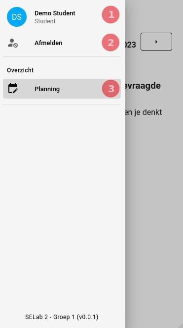

# Student
Een student is een gebruiker die afval ophaalt bij toegekende gebouwen op gegeven dagen.
Hier kan u een overzicht vinden over hoe de student de applicatie gebruikt om zijn taken te kunnen uitvoeren.

## Workflow

### Login
Voordat een student de applicatie kan gebruiken moet hij eerst [ingelogd](../pages/account/login.md) zijn.

### Student opties

In de [navigatie balk](../navbar.md#student) heeft de student 3 opties.

|            Navigatie opties            |
|:--------------------------------------:|
|  |

1. **Afmelden**: Klik op de `Afmelden` knop om uit de applicatie uit te loggen.
2. [**Account**](../pages/account/account.md): Klik op de `Account` knop om de info over u account te zien en te bewerken.
3. [**Planning**](../pages/overview/planning.md): Klik op de `Planning` knop om een overzicht van al uw ingeplande rondes te
kunnen zien.

