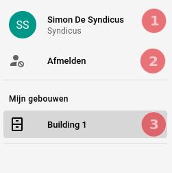

# Syndicus
Een syndicus is de eigenaar van een gebouw. Hieronder vindt u een overzicht hoe de syndicus
zijn gebouw en alle bijhorende gebeurtenissen kan opvolgen.

## Login
Voordat een syndicus de applicatie kan gebruiken moet hij eerst [ingelogd](../pages/account/login.md) zijn.

## Syndicus opties
In de [navigatiebalk](../navbar.md#superstudent-syndicus-admin) heeft de syndicus 3 opties.

|        Navigatie opties         |
|:-------------------------------:|
|  |

1. [**Account**](../pages/account/account.md): Klik op uw account naam om de info over uw account te zien en te bewerken.
2. **Afmelden**: Klik op de `Afmelden` knop om uit de applicatie uit te loggen.
3. Onder de sectie `Mijn gebouwen` kan u alle gebouwen terug vinden waarvan u eigenaar bent.
Klik op een gebouw om het in [detail te bekijken](../pages/detail/gebouw.md).
