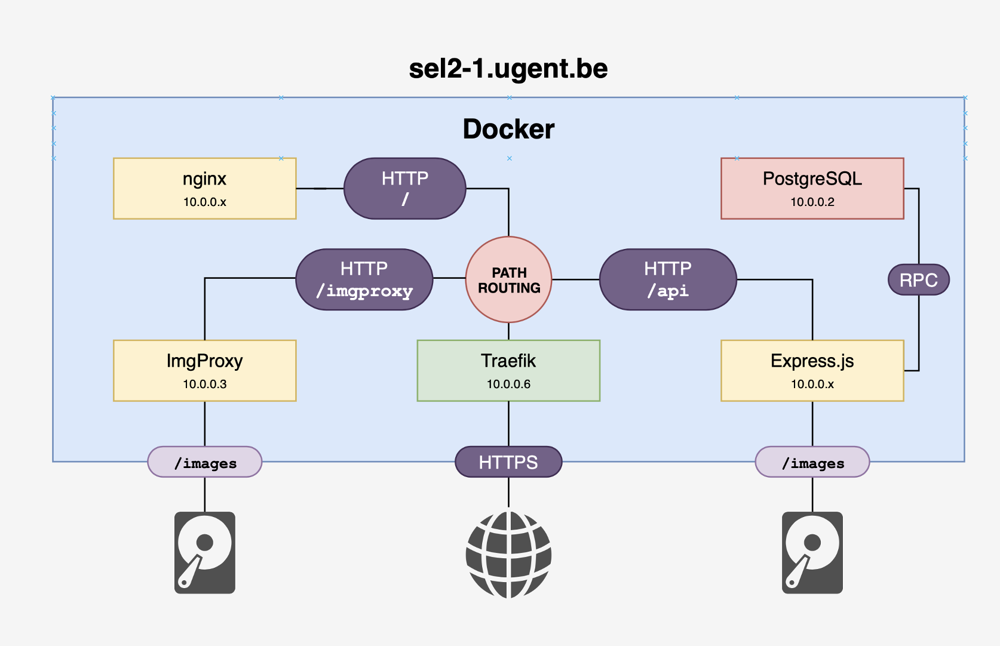

# Server

## Overview

We maken gebruik van Docker en Docker Compose om onze services in te zetten.



### Traefik

We maken gebruik van Traefik als reverse proxy. Enkele features waar wij gebruik van maken zijn:

- Path based routing
- Automatische TLS via Let's Encrypt
- Integratie met Docker Compose via labels

Een service kan toegevoegd worden aan het Traefik netwerk met de volgende labels.

```yml
labels:
- "traefik.enable=true"
- "traefik.http.routers.api.rule=Host(`sel2-1.ugent.be`)"
- "traefik.http.routers.api.rule=PathPrefix(`/api/`)"
- "traefik.http.routers.api.entrypoints=websecure"
- "traefik.http.routers.api.tls.certresolver=letsencrypt"
- "traefik.http.services.api.loadbalancer.server.port=8081"
- "traefik.http.middlewares.api.stripprefix.prefixes=/api/"
```

### ImgProxy

ImgProxy is een microservice voor het aanbieden van afbeeldingen overheen het web. Aan de hand van URL parameters geven we de breedte en hoogste in pixels aan, alsook de encodering, kwaliteitsparameters, crop, enzovoort. Hierdoor besparen we kopzorgen in verband met het bijhouden van meerdere versies van dezelfde afbeelding.


### Lokale development omgeving
Om gemakkelijk lokaal te kunnen ontwikkelen is `developer-compose.yml` voorzien. Deze bevat identieke diensten als wat op de server staat, maar is voorbereid om de diensten lokaal te draaien.
Gebruik dus bij voorkeur deze diensten bij je ontwikkeling.
Je hebt Docker met de Docker Compose plugin nodig om deze te kunnen uitvoeren.

De diensten zijn zo opgezet dat de afhankelijkheden van de verschillende diensten automatisch opgestart worden. Zo is API afhankelijk van de databank, dus deze wordt ook opgestart.

De diensten gebruiken omgevingsvariabelen opgeslagen in .env bestanden. De nodige variabelen voor lokale ontwikkeling zijn opgeslagen in `server/developer.env`.
De script `generate_data.sh` zal de reeds bestaande `.env` bestanden opslaan in `.env.bak` vooralleer ze worden overschreven.
Vervolgens zat het de lokale databank vullen met mock data.

```bash
# bouw de diensten op
docker compose --file=developer-compose.yml build
# start de diensten op
docker compose --file=developer-compose.yml up -d

# vul de databank met mock data
./generate_data.sh

# stop de diensten
docker compose --file=developer-compose.yml down
```

De diensten zijn lokaal beschikbaar op volgende adressen:
| Dienst   | Adres(:poort) |
|----------|---------------|
| Databank | 10.0.0.3:5432 |
| ImgProxy | 10.0.0.4:8081 |
| API      | 10.0.0.5:8080 |
| Frontend | 10.0.0.6:3000 |

Je aanpassingen zullen niet zichtbaar zijn in de containers zonder ze eerst opnieuw te builden.
Je kunt dus ook diensten specifiëren die je draaiend wilt hebben.
Stel bijvoorbeeld dat je je nieuwe aanpassingen aan frontend wilt testen, met gebruik van de lokale versie van de API. Lokale API kan je opzetten met:
```bash
# start enkel de API
docker compose --file=developer-compose.yml up api -d
```
Deze is bereikbaar op 10.0.0.5:8080. Vergeet niet om je frontend code in te stellen om deze adres te gebruiken.
